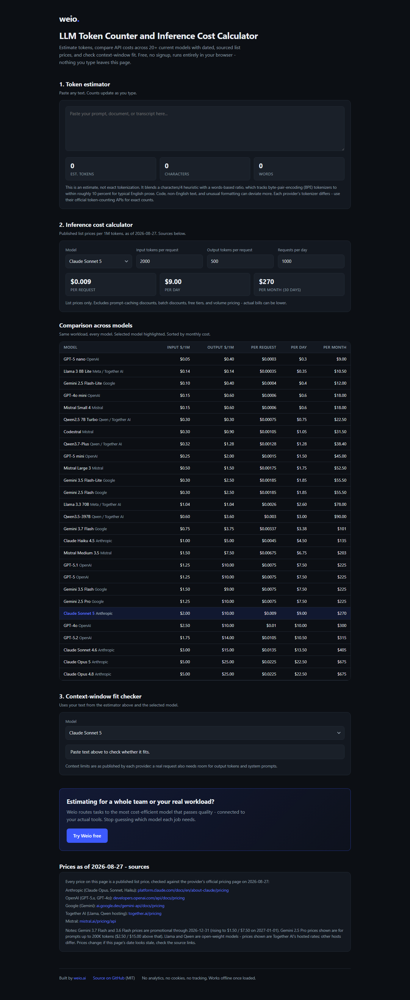

# LLM Token Counter and Inference Cost Calculator

Free, no-signup token estimator and LLM API cost calculator. Compare inference costs
across current Claude (Opus, Sonnet, Haiku), GPT-5.x and GPT-4o, and Gemini models - with
dated, sourced list prices. Plus a
context-window fit checker for your actual text.

**Use it here: [weioai.github.io/llm-cost-calculator](https://weioai.github.io/llm-cost-calculator/)**

## Features

- **Token estimator** - paste text, get an approximate token count (blended chars/4 +
  word-ratio heuristic; honest about being an estimate, within roughly 10 percent for
  typical English prose).
- **Inference cost calculator** - input tokens, output tokens, requests/day in;
  cost per request / day / month out, for any model.
- **Comparison table** - the same workload priced across every model, sorted by
  monthly cost.
- **Context-window fit checker** - does your text fit the selected model's published
  context limit?

## Why trust the prices

Every price is a published list price checked against the provider's official pricing
page, with the check date shown on the page (currently 2026-08-27) and source links in
the footer of the tool. No invented numbers.

## Privacy

100 percent client-side. A single static HTML file with zero dependencies, no analytics,
no cookies, no network calls. Nothing you paste ever leaves your browser, and the page
works offline once loaded.

## Built by Weio

[Weio](https://weio.ai) routes tasks to the most cost-efficient model that passes
quality - connected to your actual tools. This calculator is one of our free developer
utilities.

## License

MIT
